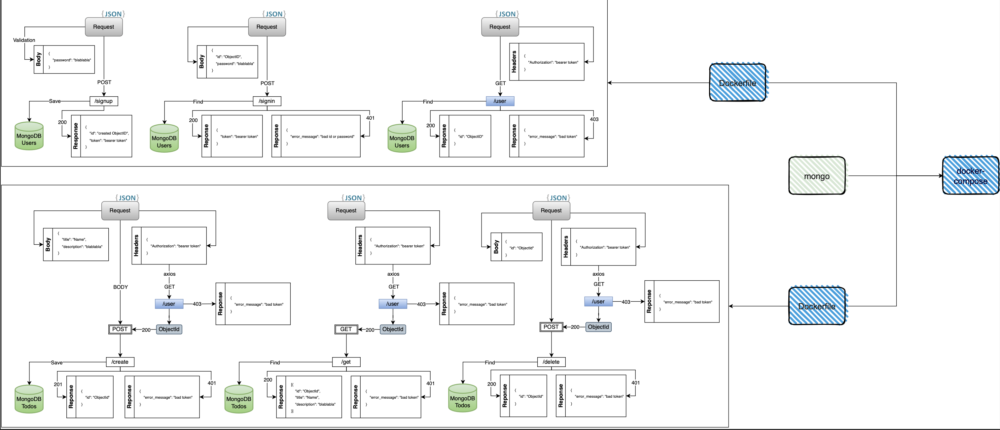

#Backend test task

Architecture:


## Table of contents

- [Description](#description)
- [Technologies](#technologies)
- [Structure](#structure)
- [Installation](#installation)


## Description
The project includes two micro-services: auth and todo. Auth - this is a micro authentication service with mongodb; Todo - this is a micro service for creating user's posts, they comminucate on axios and save posts as a collection to mongodb.

## Technologies
- Node.js
- NestJS (passport, passport-local)
- mongoose
- axios
- ...other packages

## Installation
#### Installation by docker

(NOTE: make sure that you have created mongodb image, if you have not - create one and provide your creds or mine: username, password, database and do not forget to change my creds in all files: .env, docker-compose.yaml)

> **PS: My database will stop being worked on 11.25.2023**

(NOTE: the provided code is created for docker installatioin, not for locally use, if you want to make an install by local machine - read below)
```bash
$ docker run --rm --name mongodb -e MONGO_INITDB_ROOT_USERNAME=Herman -e MONGO_INITDB_ROOT_PASSWORD=admin123 -e MONGO_INITDB_DATABASE=test -v /tmp/mongo-data:/data/db mongo:latest

$ docker login

$ docker compose up
```

#### Installation by local machine
(NOTE: in ./todo/api/token.service.ts change axios URL 'http://auth-microservice:5000/auth/user' to 'http://localhost:5000/auth/user')
```bash
$ cd auth
$ yarn install
$ yarn start:dev

$ cd todo
$ yarn install
$ yarn start:dev
```


